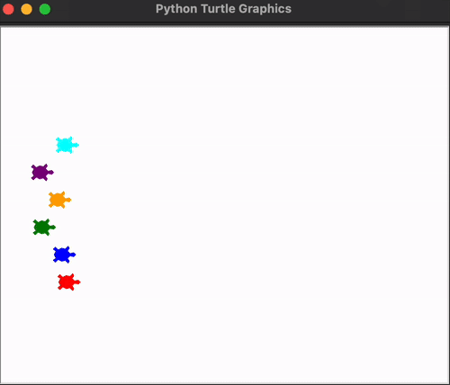

# 🐢 Turtle Race Game

A fun Python mini-game built using the `turtle` graphics library.  
Bet on a turtle, watch them race, and see if your guess was right! 🎉

---

## 🎮 How to Play
1. Run the game.
2. Enter the color of the turtle you want to bet on.  
   Options: **red, blue, green, orange, purple, cyan**
3. The turtles will start racing across the screen.
4. If your turtle wins, you win the bet! 🏆

---

## 🚀 Getting Started

### Prerequisites
- Python 3.13.7 installed  
- `turtle` library (comes with Python by default)

### Run the game
```bash
python turtle_race.py
```

## 🎥 Demo

<p align="center">
  
</p>